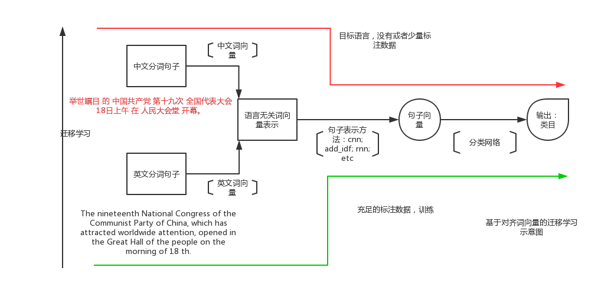
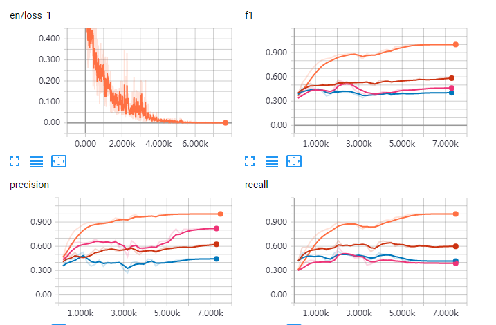

# README
Multilingual Embedding based Transfer Learning.

## Network
   

## Prerequisite
* tensorflow 1.3+
* sklearn, numpy
* extract all_utils/[utils tf_utils nlp], put wherethey  could be direct imported, local or global
(in my system global)

## Example Usage
* train: python text_cnn.py
* predict: python predict.py
* new model: python dynamic_model.py

## example log of ted_cldc
datasets:
* train:(en 80%)
* dev:(en 20%)
* test1:(de 80%,parallel to train)
* test2:(de 20%,parallel to dev)
* full tags(biology,economics,art,business,entertainment,science,global,creativity,culture,design,politics,health,education,technology)
* limited tags(biology,economics,art,business,entertainment,politics,health,education,technology)

Results
+ limited tags: use cpt_vec+ cnn[1]*100 get Best: dev(0.52) test1(0.46) test2(0.45) like following log.  
+ full tags:use aligned_vec +cnn[1]* 100 get Best: dev(0.50) test1(0.34) test2(0.33)  
+ full tags:use aligned_add_idf get Best:dev(0.55), test1(0.34) test2(0.37)  

 

Multilingual ted multi_tag(12 tag) classfication from source(en) to target(en)

## Vecs
* multilingual vecs is put on ftp 
** linux系统：lftp ftps://nlp_data@117.121.7.29 (或lftp ftps://nlp_data@192.168.49.48) 
* multilingual vecs train code is on git : http://git.baifendian.com/xia.hong/MultilingualNLP

## Contact
xia.hong@baifendian.com
